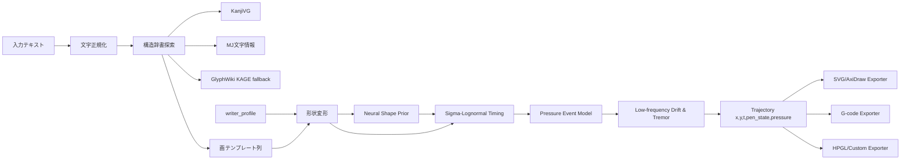
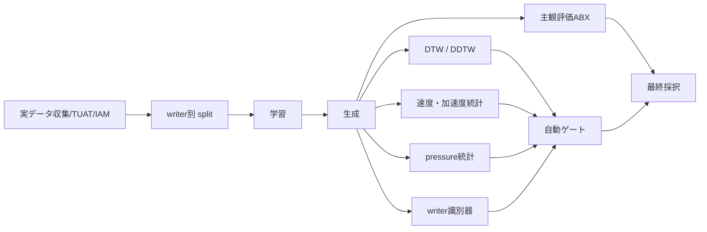

以下はプロジェクト立ち上げ時に DeepResearch で作成した調査報告書である。現状の方針と相違している可能性があるので、参考程度にすること。変更は禁止。

# 日本語筆記エンジンの設計と実装計画

## エグゼクティブサマリ

本調査の結論は明確で、**最初の実装候補は「文字構造辞書 + Sigma-Lognormal 運動生成 + writer profile + 必要最小限の神経モデル」を組み合わせたハイブリッド構成**にすべきです。理由は、日本語の手書きを「ペンプロッタで、しかも手書きと区別がつかない水準」に近づけるには、字形だけでなく**時間軸・速度プロファイル・ペンアップ処理・行方向のゆらぎ**まで制御する必要があり、この要件にもっとも直接適合するのが Sigma-Lognormal 系だからです。Plamondon の運動理論は急速運動のベル型速度を説明し、iDeLog はそのパラメータ抽出を実装可能な形にしています。対して GAN 系は画像としては強い一方で、直接に `x,y,t,pen_state` を生成しにくく、プロッタ制御にそのまま乗せにくい、というミスマッチがあります。citeturn42search5turn35search0turn46view2turn13search2turn34view0

日本語データについては、**TUAT Nakagawa 系データベースを主軸**に置くのが妥当です。Kuchibue は孤立文字寄り、Nakayosi は新聞文抜粋の連続テキスト寄りで、前者は字単位の運動モデル、後者は字間配置・行方向ドリフト・文脈依存の接続に向いています。これに **KanjiVG** の筆順・画種・部品構造、**MJ 文字情報一覧表**の異体字・UCS/IVS 対応、必要に応じて **GlyphWiki/KAGE** の部品展開を重ねると、JIS 第一水準 + ひらがな・カタカナの構造辞書をほぼ機械的に組み上げられます。IAM-OnDB は日本語ではありませんが、writer embedding や一般的なオンライン筆記ダイナミクスの事前学習には有用です。ETL と Quick, Draw! は主データではなく、形状多様化やノイズ学習の補助と割り切るのが安全です。citeturn43search0turn44view2turn43search12turn25view0turn25view1turn27view0turn27view2turn28search13turn32view0turn22view0turn24view0

ハードウェア面では、AxiDraw/NextDraw 系のような**実績ある XY ペンプロッタにまず合わせる**のが現実的です。AxiDraw V3 系は公式仕様として 80 steps/mm、低速時の XY 再現性 0.1 mm 程度を掲げており、レポート内で仮定する **±0.2 mm の位置目標**は十分に射程内です。ただし、AxiDraw の公式 API がネイティブに持つのは**ペン高さ、上下速度、XY 速度、遅延**であり、**閉ループの実圧力計測ではない**ため、`pressure` は最初の版では「仮想筆圧」として保持し、AxiDraw では pen-down 高さや速度・遅延へ写像する設計が現実的です。圧力そのものを真面目に再現したいなら、将来的には**コンプライアント機構付き Z 軸**か**荷重センサ付き自作プロッタ**へ拡張する前提でデータ契約だけ先に用意するのが良いです。citeturn40view1turn30view0turn47search1

実装順としては、**MVP を「辞書駆動 + Sigma-Lognormal」だけで成立させ、神経モデルは変動生成専用の第二段で足す**のが最小リスクです。DeepWriteSYN や DeepWriting は、短セグメント VAE / C‑VRNN による多様化やスタイル分離が有効であることを示しており、Write Like You や最近の CASHG の系譜は、few-shot スタイル適応や文レベル接続性の明示化に価値があることを示しています。したがって、**第一段は「手で意味のわかる運動学モデル」**、**第二段は「画形状候補の変動生成器」**にするのが、実装可能性と最終品質の両方で最適です。citeturn14search1turn46view1turn16search4turn12search2turn34view0

## 要件定義と成功条件

未指定項目については、本レポートでは**文字集合を JIS 第一水準 + ひらがな・カタカナ**、**リアルタイム性は不要**と仮定します。この仮定は、日本語実用文をかなり広くカバーしつつ、辞書構築を現実的な範囲に収めるためです。TUAT 系データベースが JIS 第一水準やかなを含む大規模日本語オンライン手書きデータを前提にしていること、KanjiVG と MJ が構造辞書の基盤になり得ることから、この仮定は研究・実装の両面で妥当です。citeturn33search0turn43search0turn44view2turn25view0turn27view0

| 項目 | 本レポートの前提 | 実装上の意味 |
|---|---|---|
| 出力契約 | `x, y, t, pen_state, pressure` を**内部の正準表現**にする。オンライン手書きデータ処理では `x, y, timestamp, pen status, pressure` を持つ表現が一般的で、将来の再利用もしやすい。citeturn11search22 | 学習器・評価器・エクスポータの間をこの 5-tuple で統一する。 |
| 文字集合 | 未指定のため、JIS 第一水準 + ひらがな・カタカナを想定。TUAT・ETL・KanjiVG・MJ の組み合わせで十分な辞書土台を取れる。citeturn33search0turn22view0turn25view0turn27view0 | MVP では頻出文字から優先しつつ、辞書は最初から全体対応可能な設計にする。 |
| 精度目標 | 位置精度は **±0.2 mm** を目標値にする。AxiDraw V3 系の公式仕様は低速時 XY 再現性 0.1 mm 程度、ネイティブ分解能 80 steps/mm。citeturn40view1 | 目標値は機械精度より少し緩く設定し、残差は運動モデルと用紙・筆記具誤差に割り当てる。 |
| 速度目標 | 局所ピーク速度位置誤差 < 10%、生成線と実線の速度分布差は DDTW/DTW・分布比較で監視する、という**設計目標**を置く。人はベル型速度プロファイルをより自然・快適と知覚する。citeturn42search0turn42search9turn42search5 | 「字形が似る」だけでなく「書き方が似る」を定量化する。 |
| 筆圧 | 第一版では**仮想筆圧**を保持し、AxiDraw では pen-down 高さ・下げ速度・遅延・速度へ写像する。AxiDraw API は `pen_pos_down/up`、`pen_rate_lower/raise`、`speed_pendown` を提供する。citeturn30view0 | 将来の荷重制御プロッタ移行に備え、今のうちに pressure を出力契約へ入れる。 |
| リアルタイム性 | 不要と仮定。AxiDraw もファイルベース SVG と API の両方を持ち、バッチ生成が自然。citeturn40view1turn30view0 | 推論速度よりも筆記品質、writer 適応、評価自動化を優先する。 |

この要件から逆算すると、成功条件は三つです。第一に、**字形辞書だけではなく運動学辞書を持つこと**。第二に、**writer profile を低次元で持ち、few-shot で更新できること**。第三に、**プロッタ固有制約を出力契約とは分離すること**です。ここを最初に分けておくと、AxiDraw でも G-code でも同じ筆記エンジンを流用できます。AxiDraw が「手書きらしい結果」を公式に想定している一方で、実機 API は SVG・速度・ペン高さの層に留まるため、**手書きらしさの責任はエンジン側に置く**設計が正しいです。citeturn40view1turn30view0

## データと文字構造資産

日本語筆記エンジンの学習資産は、**オンライン軌跡データ**と**文字構造辞書**を明確に分けて扱うべきです。オンライン軌跡データは「どう動くか」を、文字構造辞書は「何を書くか」を規定します。TUAT、IAM-OnDB、Quick, Draw! は前者、KanjiVG・MJ・GlyphWiki は後者として使うのが筋です。ETL はオフライン画像なので、厳密には前者ではなく、**coverage booster / stroke recovery 補助**です。citeturn43search0turn44view2turn32view0turn24view0turn22view0turn25view0turn27view0turn28search13

| 資産 | 主要特徴 | ライセンス・入手性 | 推奨用途 | 前処理 | 推奨工数 | 主なリスクと代替 |
|---|---|---|---|---|---:|---|
| **TUAT Kuchibue** | TUAT 2004 論文では 120 人規模の大規模オンライン日本語文字 DB の一部。配布サンプルは 10 人分、3356 字種、1 セット 11962 文字。孤立文字寄りで、JIS 第一水準・かな・英数字を含む。citeturn44view2turn33search0 | TUAT 配布ページ経由。オープンライセンスではなく、サンプル配布/購入ベース。IPDB LIB が公開。citeturn43search5turn33search0 | **主資産**。文字単位の運動モデル、writer style 初期学習、Sigma-Lognormal 抽出の本丸。 | IPDB 読み出し、座標正規化、ペンアップ分割、writer-id 単位 split。 | 4–6 人日 | 入手手続きが最大リスク。代替は自前 Wacom 収集 + KanjiVG 辞書。 |
| **TUAT Nakayosi** | 163 writers による新聞文抜粋の連続オンライン手書き。別資料では 4438 classes 規模。連続文なので字間・行方向の癖を含む。citeturn43search0turn43search12 | TUAT 配布ページ。Kuchibue 同様にオープン配布ではない。citeturn43search5 | **主資産**。行組・ベースラインドリフト・文脈依存 spacing・連続文筆記の writer profile 学習。 | テキスト整列、行/bigram 単位の切り出し、字間距離特徴抽出。 | 4–6 人日 | 同じくアクセス性。代替は自前 sentence corpus。 |
| **IAM-OnDB** | 英語オンライン手書き。221 writers、1700 超 forms、13049 line、writer-id・転写・設定が XML に入る。非商用研究のみ。citeturn32view0turn32view1 | 登録後ダウンロード。非商用研究用途。citeturn32view0turn32view1 | 日本語字形には使わず、**writer embedding・sequence encoder・pen-up/down モデル**の事前学習へ。 | XML パース、stroke line 展開、writer metadata 抽出。 | 3–5 人日 | 言語ミスマッチ。代替は DeepWriting preprocessed IAM 拡張。 |
| **ETL** | 約 120 万の手書き/印字文字画像。ETL8/9 は漢字・ひらがなを含み、無料で利用可能だが、データそのものの無断再配布は禁止。citeturn22view0turn22view1 | AIST 公式、無料。再配布制約あり。citeturn22view1 | **補助資産**。coverage 拡張、offline-to-online 逆変換、構造学習・識別器の hard negative 生成。 | 画像正規化、骨格化、オフライン→オンライン復元候補生成。 | 3–4 人日 | 時間情報がない。代替は KanjiVG からの正順テンプレート。 |
| **KanjiVG** | 各文字の SVG に stroke order、direction、部品構造、stroke type を持つ。CC BY-SA 3.0。2025 年にもリリース更新あり。citeturn25view0turn25view1turn26view0 | オープン。CC BY-SA 3.0。citeturn25view0turn26view0 | **構造辞書の主資産**。筆順・画種・部品境界・variant 無しの初期テンプレート生成。 | SVG path 抽出、部品木生成、JIS/UCS 対応付け。 | 5–8 人日 | 収録外の異体字・人名字は弱い。代替は MJ / GlyphWiki 補完。 |
| **MJ 文字情報一覧表** | 約 6 万字規模の行政・人名漢字基盤。UCS・IVS・MJ 文字図形名の対応表を CC BY-SA 2.1 JP で提供。citeturn27view0turn27view2 | オープン。CC BY-SA 2.1 JP。citeturn27view0 | **異体字マッピングの主資産**。JIS 第一水準外や variant bridge、MJ→UCS/IVS 解決。 | 文字コード対応表の DB 化、KanjiVG との join。 | 2–4 人日 | 直接の筆順情報は弱い。代替は GlyphWiki/KAGE 部品展開。 |
| **GlyphWiki / KAGE** | KAGE 形式から SVG を生成可能。部品指向の glyph 展開に強い。再利用権は広い一方、データライセンスとサイトポリシの制約を指摘する研究もある。citeturn28search13turn28search5turn20search1turn20search8turn18search8 | 公開利用は可能だが、**データライセンス/サイトポリシ確認が必要**。citeturn18search8turn20search1turn20search8 | **fallback 構造辞書**。KanjiVG 非収録字、部品展開、異体字の形状補完。 | KAGE dump 展開、SVG 変換、骨格抽出。 | 5–7 人日 | ライセンス確認と dump 整理コスト。代替は MJ + user exemplar。 |
| **Quick, Draw!** | 50M drawings / 345 categories の timestamped vector。raw 形式は `x,y,t` と category, countrycode を持つ。CC BY 4.0。writer-id は documented field に無い。citeturn24view0 | オープン。CC BY 4.0。citeturn24view0 | **補助資産**。ノイズモデル、汎用 sequence autoencoder、粗い stroke simplification 学習。 | raw のみ利用し、simplified は使わない。domain filtering 必須。 | 2–3 人日 | 落書きドメインで日本語文字と乖離。主学習には使わない。 |

データ前処理の基本方針は、**「writer をまたがない split」「字形と運動を分離」「すべてを正準 5-tuple に落とす」**の三点です。IAM-OnDB は XML に writer-id・転写・設定を持つため、そのまま supervised style learning に回せます。Quick, Draw! は raw に `x,y,t` があるものの writer-id が文書化されていないため、writer embedding には使わず、系列オートエンコーダや時間ノイズの事前学習へ限定すべきです。ETL は画像なので、生成器の主学習ではなく、stroke recovery 系の評価と hard negative 生成に回すのが適切です。citeturn32view0turn24view0turn22view0turn34view0

データ拡張は、日本語では**画数変動と筆順変動を“禁止”しすぎない**ことが重要です。TUAT の分析論文は、画数の多い文字ほど実筆では画が減りやすく、筆順変動は common habits と added strokes によって生じると報告しています。したがって、単純な affine jitter だけでは不十分で、**stroke omission / merge / split / terminal variation / speed warp / baseline drift** を持つ拡張が必要です。DeepWriteSYN のような短セグメント生成や、survey に整理された Gaussian / Bernoulli / sinusoidal / sigma-lognormal 系の歪みは、そのまま転用できます。citeturn44view2turn14search1turn34view0

## モデル比較と推奨アーキテクチャ

**前提知識**  
**MDN** とは、連続値の次状態を単一値ではなく混合分布で出す方式である。今回の文脈では、次筆点や速度・方向の不確実性をそのまま表現するために使う。  
**Sigma-Lognormal** とは、人の素早い運動を重ね合わせた lognormal 速度成分として表す運動学モデルである。今回の文脈では、字形ではなく「どう動いたか」を表す核になる。

今回の目的に対するモデル比較では、**“見た目の文字画像を作れるか”ではなく、“`x,y,t,pen_state,pressure` を人間らしく出せるか”**を中心に評価すべきです。その観点では、Plamondon 系は直接適合、Graves 系と VAE 系は補助的に有効、Transformer 系は研究価値が高いが過学習・データ要求が大きい、GAN 系は画像寄りで初手としては不利、という整理になります。survey 論文でもオンライン→オンライン変換では Sigma-Lognormal、VAE、style-disentangled Transformer、RNN、GAN などが併存していますが、プロッタ用途では出力形式の親和性が順位を変えます。citeturn34view0

| モデル族 | 代表研究・実装 | 出力形式適合性 | 個人癖制御 | 学習データ量 | 実装難易度 | 推論速度 | 再利用しやすい実装 | MVP導入工数 | 主なリスクと代替 |
|---|---|---:|---:|---:|---:|---:|---|---:|---|
| **Sigma-Lognormal** | Plamondon の運動理論、iDeLog 抽出器。軌跡と速度を joint に扱う抽出が可能。citeturn42search5turn35search0turn46view2 | ◎ | ◎ | 低〜中 | 中 | ◎ | iDeLog (MATLAB, license 要確認)。citeturn46view2 | 8–12 人日 | 長文連続筆記で成分分解が難しくなる。代替は char/seg 単位で分割して使う。 |
| **Graves LSTM+MDN** | 代表的なオンライン手書き生成系。公開実装では style priming と bias による neatness 制御が提供される。citeturn46view0 | ○ | ○ | 中〜高 | 中 | ○ | `handwriting-synthesis` 実装が広く参照される。citeturn46view0 | 10–15 人日 | 字形は出せても日本語構造の保証が弱い。代替は辞書で content を固定する。 |
| **VAE / Sketch-RNN / 短セグメントVAE** | Sketch-RNN は seq2seq VAE + mixture-density decoder。DeepWriteSYN は短時間セグメント VAE、DeepWriting は C‑VRNN。citeturn13search3turn13search9turn14search1turn46view1 | ○ | ○ | 中 | 中〜高 | ○ | DeepWriting は MIT、Magenta の sketch-rnn は公式実装あり。citeturn46view1turn47search6 | 12–18 人日 | 漢字全体を一気に生成すると構造逸脱が出る。代替は「画単位 VAE」に限定。 |
| **Transformer 系オンライン生成** | Write Like You は few-shot style transfer を狙う sequence model。CASHG は Transformer decoder で sentence-level の接続性を明示的に扱う。citeturn16search4turn12search2 | ○ | ◎ | 高 | 高 | △〜○ | 研究再現性は高いが、日本語公開実装は乏しい。citeturn16search4turn12search2 | 18–30 人日 | データ要求が大きい。代替は style encoder だけ導入して生成は運動学で行う。 |
| **GAN 系** | SLOGAN などは arbitrary-length/offline handwriting image で強いが、主に画像生成。survey でも text-to-HW / off-line 系として整理される。citeturn13search2turn13search14turn34view0 | × | ○ | 高 | 高 | ○ | 画像生成コードは多い。citeturn13search2 | 15–25 人日 | `x,y,t` へ戻す工程が重く、筆記エンジンの主系には不向き。 |

**優先実装候補**は、**第一候補が Sigma-Lognormal 主体のエンジン**、**第二候補が短セグメント VAE / Graves 系を“形状候補生成”にだけ使うハイブリッド**です。DeepWriteSYN は短セグメント生成が現実的であることを示し、Write Like You は few-shot style adaptation の有効性を示していますが、どちらも日本語漢字の大規模構造保証までは与えません。そこは KanjiVG/MJ ベースの辞書が必要です。つまり、**Content は辞書、Style と Variation は学習、Timing は Sigma-Lognormal**という分業がもっとも堅いです。citeturn14search1turn16search4turn25view0turn27view0turn35search0

## 筆記エンジン設計

**前提知識**  
**IVS / IVD** とは、同じ Unicode 文字でも字形差を区別して指定する仕組みである。今回の文脈では、MJ 文字情報一覧表の異体字対応や人名漢字の字形差を保持するために使う。  
**KAGE** とは、部品と制御点から漢字グリフを合成するエンジン群である。今回の文脈では、KanjiVG にない字の fallback 構造資産として使う。

### 文字構造辞書

構造辞書の生成手順は、**KanjiVG を第一辞書、MJ をコード・異体字辞書、GlyphWiki/KAGE を fallback 辞書**とする三層構成がもっとも実装しやすいです。KanjiVG の SVG は、stroke order、stroke direction、部品構造、radical、stroke type を XML 属性で持っています。MJ は UCS/IVS/MJ 文字図形名の対応表を提供します。GlyphWiki/KAGE は部品展開と未収録字の補完に使えます。citeturn25view0turn25view1turn27view0turn28search13turn28search5

手順としては、まず KanjiVG の `StrokePaths` をパースして**画列と部品木**を取り出し、その Unicode を MJ 一覧表へ join して、必要なら IVS/MJ 文字図形名を持たせます。KanjiVG にない字、あるいは KanjiVG の main では不足する variant は、GlyphWiki dump を KAGE で SVG 化し、骨格抽出して**疑似 stroke template**に落とします。GlyphWiki は再利用自由度が高い一方、研究用途でもデータライセンスとサイトポリシの確認が必要と指摘されているため、**本番辞書に入る前に license whitelist を通す**運用が必要です。citeturn26view0turn27view0turn18search8turn20search1turn20search8

以下は、実装向けの**画テンプレート JSON スキーマ例**です。これは提案仕様であり、KanjiVG の stroke order / stroke type と、後段の運動学・writer profile を接続するための最小構成です。

```json
{
  "$schema": "https://example.org/stroke-template.schema.json",
  "char_id": "U+6F22",
  "char_set": "JIS1",
  "source": {
    "primary": "kanjivg",
    "variant": "main",
    "mj_glyph_name": "MJ012345",
    "ivs": "U+6F22 U+E0101"
  },
  "layout_box": { "x": 0.0, "y": 0.0, "w": 1.0, "h": 1.0 },
  "components": [
    { "id": "left", "element": "氵", "bbox": [0.0, 0.0, 0.34, 1.0] },
    { "id": "right", "element": "𦰩", "bbox": [0.34, 0.0, 0.66, 1.0] }
  ],
  "strokes": [
    {
      "stroke_id": 1,
      "stroke_type": "ten",
      "order": 1,
      "control_points": [[0.10, 0.16], [0.14, 0.20]],
      "terminal": { "start": "dot", "end": "fade" },
      "sigma_seed": {
        "D": 0.08,
        "mu": -1.8,
        "sigma": 0.32,
        "theta_s": -1.2,
        "theta_e": -0.9
      }
    }
  ]
}
```

**不明筆順**の扱いは、厳密に一つに決め打ちしない方が良いです。優先順位は、**KanjiVG 筆順 > user exemplar > GlyphWiki/KAGE 部品順推定 > 低信頼フラグ付き heuristic**です。日本語筆記では、TUAT 論文が示すように筆順変動や added strokes が普通に起きるので、辞書側でも `order_candidates` と `confidence` を持たせ、生成時に writer profile に応じて確率的に選ばせる設計が自然です。citeturn25view1turn44view2

### 個人癖モデル

writer profile は、**埋め込みベクトル + 解釈可能な低次元パラメータ**の二層に分けるのが良いです。埋め込みは writer-id 付き TUAT / IAM から学習し、few-shot 適応は Write Like You が示すような style encoder / metric-based learning の考え方を借ります。解釈可能パラメータは production 調整に使い、few-shot ではベイズ更新、学習時には埋め込みからの回帰ヘッドで推定させます。DeepWriting も style-content disentanglement を強調しており、この分離方針と相性が良いです。citeturn32view0turn16search4turn46view1

推奨パラメータは、`slant`, `baseline_drift`, `x_height_ratio`, `speed_mean`, `speed_cv`, `tremor_freq`, `tremor_gain`, `lift_latency_ms`, `pen_down_latency_ms`, `harai_gain`, `hane_gain`, `tome_gain`, `spacing_mean`, `spacing_cv`, `stroke_omit_prob`, `stroke_merge_prob` です。日本語らしさの要は、**欧文で効く slant だけでは足りず、終筆イベントとかな/漢字の spacing を別に持つこと**です。TUAT の連続文データは spacing と baseline drift に、KanjiVG の stroke type は `harai/hane/tome` 類のイベント設計に効きます。citeturn43search0turn25view1

以下は **writer_profile** の保存形式例です。

```json
{
  "$schema": "https://example.org/writer-profile.schema.json",
  "writer_id": "profile_demo_001",
  "embedding": [0.013, -0.221, 0.098, 0.441],
  "params": {
    "slant_deg": 4.5,
    "baseline_drift_mm_per_char": 0.06,
    "speed_mean_mm_s": 42.0,
    "speed_cv": 0.18,
    "tremor_freq_hz": 7.2,
    "tremor_gain_mm": 0.03,
    "lift_latency_ms": 38,
    "pen_down_latency_ms": 24,
    "harai_gain": 1.18,
    "hane_gain": 1.07,
    "tome_gain": 0.92,
    "spacing_mean_mm": 1.35,
    "spacing_cv": 0.22,
    "stroke_omit_prob": 0.01,
    "stroke_merge_prob": 0.03
  },
  "adaptation": {
    "method": "bayes_few_shot",
    "support_samples": 12,
    "updated_at": "2026-06-05T10:00:00+09:00"
  }
}
```

学習法は三段階が現実的です。**教師あり**では writer-id 分類 + contrastive loss で seen writer embedding を学び、**メタ学習**では few-shot 適応性能を改善し、**ベイズ推定**では本番で少量サンプルから profile の posterior を安定に更新します。業務上は最後のベイズ更新が効きます。なぜなら、writer ごとに毎回 full retrain せずに、`speed_mean` や `harai_gain` だけを安全にずらせるからです。Write Like You は few-shot style transfer の有効性を、IAM は writer-id を伴う supervised setting の実用性を支えます。citeturn16search4turn32view0

### 運動生成パイプライン

Sigma-Lognormal の中核は、**一つの運動成分が lognormal な速度ピークを持ち、それらが重なって実際の筆記になる**という点です。Plamondon の理論と iDeLog は、単なる見た目の軌跡ではなく、**速度と軌跡を合わせて**説明しようとします。今回のエンジンでは、各画を「仮想目標点列 + lognormal 速度成分列」として持ち、字形辞書から与えられた skeleton に対して writer profile に応じたパラメータ摂動を入れます。citeturn42search5turn35search0turn46view2

推奨パイプラインは、次の順です。まず構造辞書から**正準画骨格**を取り出します。次に、writer profile と前後文脈から**形状変形**を入れます。ここでは slant、縦横比、局所的な曲率増幅、かなの連綿寄り変形、ベースライン傾きなどを適用します。そこから、各画を 1〜N 個の Sigma-Lognormal 成分に分解し、`D, t0, mu, sigma, theta_s, theta_e` をサンプリングします。訓練時は iDeLog で実データからこれらを抽出し、文字種 × stroke_type × writer cluster ごとの prior を推定すれば良いです。citeturn35search0turn46view2

速度生成は、**原則として lognormal 和を主系**にし、**曲率→速度写像は補正項**に留めるのが良いです。つまり、「曲がる所では少し減速する」を直接ルール化するのではなく、まず lognormal 重ね合わせで人間らしいベル型速度を出し、残差だけを曲率補正で吸収します。こうしておくと、速度ピークの意味が保たれます。人はベル型速度プロファイルをより自然・快適と知覚し、ロボットでも人間らしさの差分として速度形状が重要だと示されています。citeturn42search0turn42search9turn42academia10turn42academia12

筆圧モデルは、第一版では**stroke event model**として設計するのが良いです。すなわち、`pressure(t)` を実測の力そのものとして学習しようとせず、`tome` では末端圧を少し上げ、`harai` では終端で滑らかに減衰させ、`hane` では跳ね直前の短いピークを入れる、といった**画種依存イベント**を持たせます。AxiDraw 系ではこの `pressure` を pen-down 高さ・下げ速度・遅延・水平速度へ変換すればよく、将来 force-aware プロッタへ移行してもデータ契約を変えずに済みます。KanjiVG は stroke type を持ち、AxiDraw API は pen 高さ・速度・遅延を個別に制御できます。citeturn25view1turn30view0

低周波ノイズは、**行方向のドリフト**と**局所ふるえ**を分けて入れるべきです。行方向には Gaussian Process 回帰や OpenSimplex 系の低周波ノイズが適し、局所ふるえは周波数と振幅を writer profile で持つ小振幅項として別に入れた方が制御しやすいです。scikit-learn は Gaussian Process を公式に提供し、OpenSimplex は方向性アーティファクトを抑える勾配ノイズの Python 実装があります。citeturn38search0turn38search8turn38search1

ペンアップ処理は、日本語では軽視できません。漢字は画数が多く、字内 pen-up が多いからです。ここは**瞬間ジャンプ禁止**が鉄則で、`pen_state=0` 区間にも物理移動の時系列を持たせるべきです。AxiDraw API は pen-up / pen-down の移動速度と遅延を分けて持つため、字内 pen-up と字間 pen-up を別クラスにする価値があります。前者は短距離低遅延、後者は長距離高速・やや大きい lift を与える設計が妥当です。citeturn30view0

以下は、提案 API と擬似コードです。

```python
from dataclasses import dataclass
from typing import Literal, List, Dict, Any

PenState = Literal[0, 1]

@dataclass
class PointSample:
    x: float          # mm
    y: float          # mm
    t: int            # ms from line start
    pen_state: PenState
    pressure: float   # 0.0 - 1.0

def load_char_dict(chars: str) -> Dict[str, Any]:
    """KanjiVG/MJ/GlyphWiki 由来の辞書エントリを返す"""

def load_writer_profile(profile_id: str) -> Dict[str, Any]:
    """writer embedding + interpretable params を返す"""

def sample_shape_skeleton(
    char: str,
    char_entry: Dict[str, Any],
    writer_profile: Dict[str, Any],
    context: Dict[str, Any],
) -> Dict[str, Any]:
    """画骨格を writer/profile/context で変形"""

def sample_sigma_params(
    skeleton: Dict[str, Any],
    writer_profile: Dict[str, Any],
) -> Dict[str, Any]:
    """各画の Sigma-Lognormal パラメータを生成"""

def render_trajectory(
    sigma_plan: Dict[str, Any],
    writer_profile: Dict[str, Any],
    dt_ms: int = 4,
) -> List[PointSample]:
    """x,y,t,pen_state,pressure 列を出力"""

def export_svg(samples: List[PointSample]) -> str:
    """pressure を metadata に持つ SVG を返す"""

def export_gcode(samples: List[PointSample]) -> str:
    """ペン上下と feedrate を含む G-code を返す"""

def synthesize_text(
    text: str,
    profile_id: str,
    line_width_mm: float = 140.0,
) -> List[PointSample]:
    char_dict = load_char_dict(text)
    writer = load_writer_profile(profile_id)
    timeline: List[PointSample] = []
    context = {"prev_char": None}
    for ch in text:
        skel = sample_shape_skeleton(ch, char_dict[ch], writer, context)
        plan = sample_sigma_params(skel, writer)
        timeline.extend(render_trajectory(plan, writer))
        context["prev_char"] = ch
    return timeline
```

短いサンプル出力は次のようになります。

```json
[
  {"x": 12.40, "y": 18.20, "t": 0,  "pen_state": 0, "pressure": 0.00},
  {"x": 12.46, "y": 18.22, "t": 8,  "pen_state": 1, "pressure": 0.31},
  {"x": 12.71, "y": 18.35, "t": 12, "pen_state": 1, "pressure": 0.36},
  {"x": 13.10, "y": 18.70, "t": 20, "pen_state": 1, "pressure": 0.41},
  {"x": 13.42, "y": 19.05, "t": 28, "pen_state": 1, "pressure": 0.27},
  {"x": 13.60, "y": 19.28, "t": 36, "pen_state": 0, "pressure": 0.00}
]
```

### ハイブリッド構成

ハイブリッド案は、**RNN/VAE が “画形状候補” を作り、Sigma-Lognormal が “時間・速度・筆圧” を与える**構成にすると最も筋が良いです。DeepWriteSYN は短セグメント VAE により realistic variation を、DeepWriting は style/content disentanglement を、Berio らは Sigma-Lognormal パラメータ表現と RMDN を結びつけた calligraphic stylisation を示しています。これらをまとめると、「神経モデルは shape prior に限定し、物理らしさは運動学で保証する」設計が浮かびます。citeturn14search1turn46view1turn36academia20

具体統合は、次の四段です。  
第一に、辞書が文字を**画列**へ分解します。  
第二に、VAE/RNN が各画または短画列の**正規化骨格**を writer embedding と文脈からサンプルします。  
第三に、その骨格へ iDeLog 由来の prior を使って Sigma-Lognormal パラメータを割り当て、`x,y,t` を復元します。  
第四に、stroke type と writer profile から `pressure` と terminal event を付与し、プロッタ向けに resample します。  

この方式の利点は、**神経モデルが字形逸脱を起こしても辞書側で拘束できる**こと、**プロッタ実行に必要な時間軸が必ず生成できる**こと、そして **few-shot adaptation を埋め込み層に限定できる**ことです。Transformer 系を将来使う場合も、ここで置き換えるのは shape prior だけで済みます。citeturn16search4turn12search2turn35search0

次の mermaid 図は、推奨するシステム構成です。



## プロッタ出力と評価設計

プロッタ出力は、**内部表現 5-tuple と機械依存表現を明確に分離**して実装するべきです。AxiDraw 系であれば SVG 入力が自然で、公式 Python API では `speed_pendown`, `speed_penup`, `accel`, `pen_pos_down/up`, `pen_rate_lower/raise`, `pen_delay_down/up`, `const_speed` を直接制御できます。したがって、**最初の実装ターゲットは SVG + pyaxidraw** が最短です。G-code 系は、多くの DIY/GRBL/Marlin 系機で再利用しやすいので第二優先に置くのが良いです。Marlin では `G0/G1` が線形移動、`M3/M5` がスピンドル/レーザ電力制御、また Laser/Spindle 設定では inline mode により move コマンド側へ出力を寄せられます。citeturn30view0turn47search1turn31search0turn45search1turn45search5

| ターゲット | 実装方式 | pressure の扱い | 推奨度 | 実装工数 | 主なリスクと代替 |
|---|---|---|---:|---:|---|
| **SVG + AxiDraw API** | Stroke を SVG path / polyline にし、segment ごとに AxiDraw の速度・pen 高さ・遅延を設定。citeturn30view0turn40view1 | 仮想 pressure を `pen_pos_down`, `speed_pendown`, `pen_delay_down` へマップ。 | ◎ | 5–8 人日 | command 粒度が細かいと遅い。代替は pressure を低周波に落として segment 数を減らす。 |
| **G-code** | `G21/G90/G0/G1` で XY、ペン上下は `M3/M5` や Z/servo に変換。Marlin/GRBL 向け postprocessor を分ける。citeturn31search0turn45search1turn31search1 | サーボ Z なら高さ、PWM なら擬似 force として扱う。 | ○ | 6–10 人日 | firmware 差分が大きい。代替は OctoPrint/Marlin 前提に限定。 |
| **HPGL / 独自プロッタ** | `PU/PD` 相当へ変換し、pressure は custom metadata で保持。 | 物理 pressure は別 adapter が解釈。 | △ | 4–6 人日 | 筆圧再現が弱い。代替は SVG を master format にする。 |

AxiDraw では、筆圧をそのまま出すのではなく、**柔らかいペン先 + pen-down 高さ差 + 速度差**で結果としての濃淡を寄せる発想が実務的です。公式製品説明でも、万年筆やローラーボールなど、過大な圧力を必要としない筆記具が最適とされています。これは圧力制御を諦めるという意味ではなく、**MVP では“圧力の結果”を再現する**方が成功確率が高い、という意味です。citeturn40view1turn30view0

以下は、**サンプル G-code** です。これは Marlin/servo 互換 postprocessor を想定した例で、`pressure` を Z または M3 PWM へ変換する雛形です。

```gcode
; sample handwriting motion
G21         ; mm
G90         ; absolute positioning
G0 X12.40 Y18.20
M5          ; pen up / tool off
G0 X12.46 Y18.22
M3 S80      ; pen down / pressure proxy
G1 X12.71 Y18.35 F2400
G1 X13.10 Y18.70 F2100
G1 X13.42 Y19.05 F1800
M5
G0 X13.60 Y19.28
```

評価は、**字形類似・運動類似・writer 類似・人間判定**の四層に分けるべきです。DTW は軌跡比較に、速度・加速度分布比較は人間らしいプロファイルの監視に、writer classifier は style leakage と style consistency の評価に向きます。survey 論文は off-to-on 系でも DTW を参照しており、CASHG は sentence-level の接続性と spacing に専用評価を導入しています。IAM-OnDB は writer identification / verification 用途も公式に想定しています。citeturn34view0turn12search2turn32view0

定量指標は次のように設計すると良いです。  
**DTW / DDTW** は教師軌跡と生成軌跡の整合。  
**速度・加速度統計** はピーク数、peak timing、jerk、bell-shape 近似度。  
**筆圧統計** は平均・分散・終筆イベント整合。ただし主要公開コーパスでは pressure が十分に文書化されていないため、これは baseline では**小規模自前コーパス**か**仮想 pressure の内部整合指標**として扱うのが現実的です。  
**writer 識別器** は、同一 writer の real/synth が混同され、異 writer が分離されるかを見る。  
**主観評価** は ABX / Turing-style の二択で、「どちらが手書きか」「どちらが同じ人らしいか」を問う。SLOGAN や CASHG でも人間評価が妥当性確認に使われています。citeturn11search22turn13search14turn12search2

実験計画の概算としては、**writer 10〜20 人、各 writer で 20〜50 文字 × 3 条件、加えて 30〜40 名の評価参加者が 40〜50 ペアを判定**できれば、比較的安定した傾向が見えます。これは本レポートの概算ですが、モデル比較と writer adaptation を同時に見るにはこの程度は欲しいです。リアルタイム要件がないため、**生成→自動評価→再パラメータ推定**の反復を CI に組み込めます。citeturn30view0turn32view1

評価フローは次のように整理できます。



## 実装計画と先行研究再利用

実装は、**MVP → 準実用 → writer adaptation → pressure/hardware 高度化**の順で進めるべきです。MVP でいきなり Transformer や GAN に行くべきではありません。KanjiVG/MJ/TUAT/iDeLog/AxiDraw API だけで、かなり強い一号機が作れます。DeepWriteSYN/DeepWriting/Write Like You は、その一号機に「変動」と「few-shot style」を足す第二段として使うのが活きます。citeturn25view0turn27view0turn35search0turn30view0turn14search1turn46view1turn16search4

| モジュール | 優先度 | 機能 | 主な再利用元 | 概算工数 |
|---|---:|---|---|---:|
| 辞書ビルダ | 高 | KanjiVG/MJ/GlyphWiki を統合し、文字→画列辞書を作る | KanjiVG, MJ, KAGE/GlyphWiki citeturn25view1turn27view0turn28search13 | 10–15 人日 |
| データ取り込み | 高 | TUAT/IAM/QuickDraw を正準 5-tuple に変換 | TUAT IPDB LIB, IAM XML, QuickDraw raw citeturn43search5turn32view0turn24view0 | 8–12 人日 |
| Sigma エンジン | 高 | iDeLog 互換の抽出・生成・再構成 | Plamondon, iDeLog citeturn42search5turn35search0turn46view2 | 15–20 人日 |
| writer profile | 高 | embedding 学習、few-shot 適応、JSON 保存 | IAM, Write Like You, DeepWriting citeturn32view0turn16search4turn46view1 | 8–14 人日 |
| Neural shape prior | 中 | 画/短画列の変動生成 | DeepWriteSYN, DeepWriting, Graves 系 citeturn14search1turn46view1turn46view0 | 15–25 人日 |
| Exporters | 高 | SVG/AxiDraw/G-code | AxiDraw API, Marlin/GRBL citeturn30view0turn31search0turn45search1turn31search1 | 6–10 人日 |
| 評価ハーネス | 高 | DTW・統計・writer classifier・ABX 管理 | CASHG, IAM, survey citeturn12search2turn32view0turn34view0 | 10–15 人日 |
| CI/可視化 | 中 | golden SVG/G-code, schema validation, metric regression | AxiDraw software, JSON schema, Shapely/GP citeturn47search1turn37search2turn38search0 | 5–8 人日 |

**総工数の概算**は、MVP で **45–60 人日**、準実用で **75–100 人日**、few-shot writer adaptation と神経 shape prior を入れた研究版で **100–130 人日** です。これは、既存資産をかなり再利用する前提の見積もりです。逆に TUAT のアクセスや自前データ収集が遅れると、最初の 2〜3 週間は辞書系に寄った開発へシフトする必要があります。citeturn43search5turn25view0turn30view0

ガント風スケジュールは次の形が現実的です。

| 作業 | 月前半 | 月後半 | 次月前半 | 次月後半 | 三月前半 | 三月後半 |
|---|---|---|---|---|---|---|
| 要件固定・出力契約 | ███ |  |  |  |  |  |
| KanjiVG/MJ 辞書統合 | ███ | ███ |  |  |  |  |
| TUAT/IAM ingestion | ███ | ███ |  |  |  |  |
| Sigma 抽出・再構成 |  | ███ | ███ |  |  |  |
| writer profile 学習 |  |  | ███ | ███ |  |  |
| SVG/AxiDraw exporter |  |  | ███ | ███ |  |  |
| DTW/統計評価 |  |  |  | ███ | ███ |  |
| Neural shape prior |  |  |  | ███ | ███ | ███ |
| G-code/DIY adapter |  |  |  |  | ███ | ███ |
| 人間評価・最終調整 |  |  |  |  |  | ███ |

ハードウェアは、**第一候補が AxiDraw/NextDraw 系**、**第二候補が GRBL ベース DIY XY プロッタ**です。AxiDraw V3 公式ページでは V3 は既に終了し NextDraw が後継とされますが、AxiDraw 系は API・CLI・SVG パイプラインが成熟しており、研究試作には最短です。DIY 機は将来の force-aware Z 軸を実装しやすい一方、初期デバッグコストが高いです。citeturn40view1turn31search1

CI/テストについては、**見た目テストよりも運動学回帰テスト**を優先してください。最低限必要なのは、辞書スキーマ検証、同一 seed での deterministic generation、SVG/G-code golden file diff、文字ごとの DTW 閾値退行検知、速度分布の KS/EMD 監視、writer classifier 精度の退行監視です。AxiDraw 側は公式 API とオープンソースドライバがあるので、実機なしでも SVG 生成と command layer までの回帰試験は切れます。citeturn30view0turn47search1

先行研究・フレームワークの再利用可能性を、実務目線で整理すると次のとおりです。

| 資産 | 再利用対象 | ライセンス/条件 | 再利用性 | コメント |
|---|---|---|---:|---|
| **KanjiVG** | 日本語文字の構造辞書、筆順、stroke type | CC BY-SA 3.0。citeturn25view0turn26view0 | ◎ | 本件の最重要公開資産。 |
| **MJ 文字情報一覧表** | UCS/IVS/MJ 対応、異体字 bridge | CC BY-SA 2.1 JP。citeturn27view0 | ◎ | 人名字・variant 解決の土台。 |
| **iDeLog** | Sigma-Lognormal 抽出の参照実装 | GitHub 公開だが、ページ上で明確な OSS ライセンス表記確認は要。citeturn46view2 | ○ | アルゴリズム参照価値は高い。MATLAB 前提。 |
| **DeepWriting** | style/content disentanglement、C‑VRNN | MIT。citeturn46view1 | ○ | shape prior と writer style encoder の土台に向く。 |
| **AxiDraw software/API** | SVG/実機制御、CLI/API | GitHub repo は GPL-2.0、examples には MIT 記載もある。citeturn47search1turn47search7 | ◎ | 実機接続の最短経路。 |
| **Shapely** | 幾何演算、接続、交差/包絡、bbox | BSD。citeturn37search2turn37search5 | ◎ | 線分処理とレイアウトに便利。 |
| **scikit-learn Gaussian Process** | baseline drift / noise モデル | BSD。citeturn38search0turn38search6 | ○ | 低周波ノイズの MVP 実装に十分。 |
| **Graves 系公認/公開実装** | sequence baseline、style priming 研究 | 実装ごとに要確認。代表 repo は広く参照される。citeturn46view0 | ○ | 主系ではなく比較ベースライン向き。 |

重要ソースは、**TUAT Nakagawa Lab. データベース案内と 2004 IJDAR 論文**、**KanjiVG 公式サイトと GitHub**、**MJ 文字情報一覧表**、**IAM-OnDB 公式ページ**、**ETL Character Database 公式**、**Quick, Draw! 公式リポジトリ**、**Plamondon 1995**、**iDeLog**、**DeepWriteSYN**、**DeepWriting**、**Write Like You**、**CASHG**、**AxiDraw Python API** です。これらを見れば、辞書・運動学・スタイル・出力・評価の各レイヤがほぼ一通り揃います。citeturn43search5turn44view2turn25view0turn26view0turn27view0turn32view0turn22view0turn24view0turn42search5turn35search0turn14search1turn46view1turn16search4turn12search2turn30view0

最終的な推奨ロードマップは、**第 一段で辞書駆動の Sigma エンジンを完成させ、第二段で writer few-shot adaptation、第三段で neural shape prior、第四段で pressure-aware hardware**へ進む、というものです。目的が「手書きと区別がつかない」ことである以上、**見た目の静的字形よりも、時間軸を持った運動の自然さ**を優先して設計するべきです。そこに日本語固有の字構造資産を重ねるのが、このテーマで最も成功確率の高い進め方です。citeturn42search0turn42search9turn25view1turn35search0turn43search0
